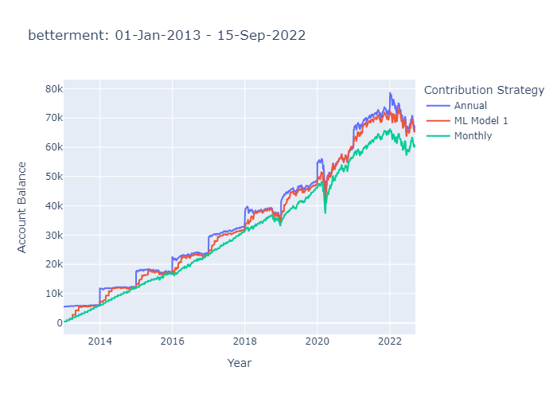

# To Time or Not to Time: That's the Retirement Question

## Summary

Using annual IRA contribution limits, we model 4 contribution strategies implemented on multiple portfolios. 

The contribution strategies we consider are: 

* Annual contribution made on the first business day of the year
* Monthly contribution made on the first business day of the month 
* Contributions made by a machine learning model, trained to predict the next 3 months of market movement
* Contributions made by an alternate machine learning model, trained to predict the next 3 months of market movement

To find a portfolio to conduct our analysis, we began by looking through portfolios listed in the [whitecoat investor](https://www.whitecoatinvestor.com/150-portfolios-better-than-yours/comment-page-3/) and selected the following 4 to consider further. 

1) Vanguard Total Stock ETF
2) Fidelity Indexed Focused Models
3) Betterment
4) Rick Ferris Core 4

We decided to use portfolio 1 as an indicator of the general market movements as it's 100% equity. This is the fund we used to train our models. 

### The Machine Learning Models

Our model predicts the movement of the market 3 months into the future. The model returns an instruction to contribute for the number of consecutive positive months, i.e. if the model predicts the following month will go down, it waits to invest at a lower point.   

We selected the SVM model because   

We added a Neural Network

We selected the ADABoost model as a model that we had not yet tested.


### The contribution strategies

The output of the machine learning model is an instruction to contribute a number of months to the investment account (between 0 and 3). 


### Conclusion 


### Next Steps 

The current model is set up to analyse historic data. We would make adjustments to feed in current data to execute. 

Further refine the machine learning model optimizing. 

In the time period we are analysing there is a general upward trend of the market. We would like to add in a buffer for changes in market trends, e.g. if the model underperforms for X months, retrain. 

The coding to plot the analysis charts needs to be refined. 

## Noteworthy 

The portfolios have varying fixed income to equity splits and are not directly comparible against one another. 

Fidelity and Betterment are comparible asset allocations.


## Conclusion

Overall the best investment strategy was to front load the contributions for the entire year. 

Between the monthly dollar cost averaging and the machine learning model, the model created better overall outcomes. 

We recommend front loading annual contribution where cash flow allows, and otherwise using the SPECIFY WHICH MODEL PERFORMED BEST model to decide when to invest.

Some example output..... 




### Betterment 


### Rick Ferris Core 4

## Installations

This application is built on python 3.7 with the following libraries:

* [pandas_datareader](https://pypi.org/project/pandas-datareader/)

``` pip install pandas-datareader ```

* [kaleido](https://pypi.org/project/kaleido/) - for saving static chart images

``` pip install -U kaleido ```

* [pandas](https://pandas.pydata.org/) - to create visual dataframes and perform financial analysis calculations
* [plotly](https://plotly.com/) - to create interactive charts
* [hvplot]() - to create interactive charts
* [pickle](https://docs.python.org/3/library/pickle.html) - to save objects and pass between notebooks


``` pip install chart_studio```

## Usage

To use this application, clone the git hub repository. 

* From your chosen Terminal run the application.py file using the instruction ``` python application.py ```.

* Choose an investment portfolio 

* Choose a machine learning model to run 

* Specify file path for saving data

In Jupyter Notebook, open portfolio returns and set the timing and portfolio parameters. 

Running this notebook, creates charts illustrating the investment balance over time. 

TO DO - ADD IN OTHER ML MODELS 
ADJUST CODE TO 


## Requirements

*Software Version Control (github) 10 points*

*Data collection and Prep 10 points*
  Data from CSV, API or databases using python - 5 YES
  Cleaned and prepared for application - 5 YES

*Machine Learning 40 points*
  jupyter, colab or sagemaker notebook created - 5 points YES
  one of more ml models - 5 points YES - SOON
  evaluate models - 10 points
  predictions using new sample and compared between models 3 points
  PNG images saved from code for README and presentation 2 points
  one new ML library, ml model OR evaluation metric used 10 points

*Documentation - 15 points*
  Code well commented and concise 5 points
  Concise project overview in README 2 points
  Detailed usage and instructions in README 3 points
  README includes examples of application or results and summary 5 points

*Presentation - 25 points*
10 minutes
  exec summary 5 points - explain relation to fintech and ML
  selected model 5 points - which model selected and why
  data prep and training 3 points - source of data and why, collection cleanup and prep process, training process
  approach to achieve goals 5 points - include code and demos, explain techniques, unanticipated insights or problems and resolution
  conclusion 5 points - images or examples
  next steps 2 points - potential expansion of project, what would we do next?
