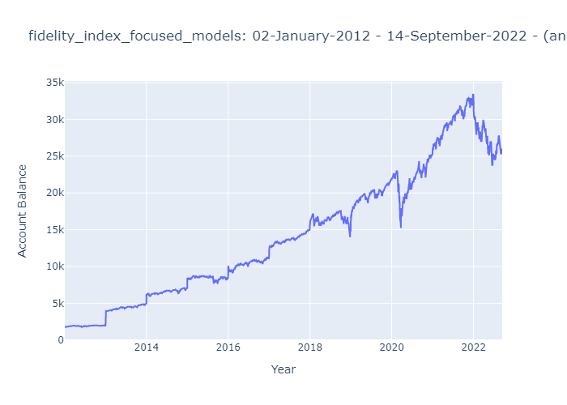
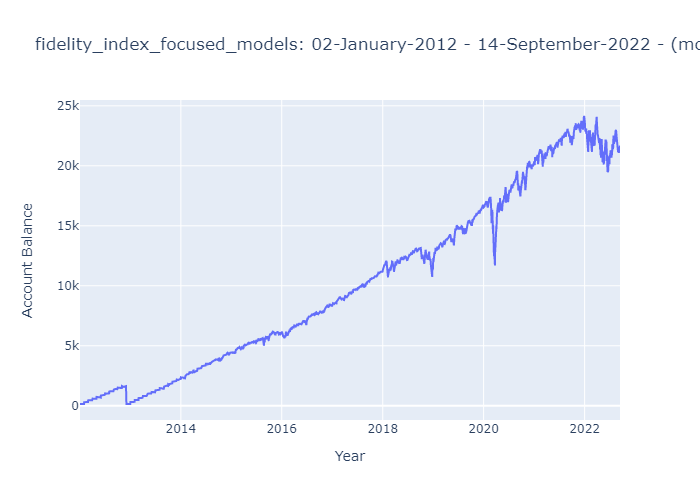
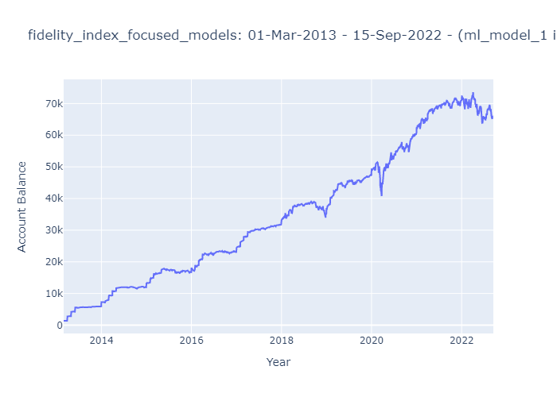

# To Time or Not to Time: That's the Retirement Questions

## Summary

Using annual IRA contribution limits, we model 4 contribution strategies implemented on multiple portfolios. 

The contribution strategies we consider are: 

* Annual contribution made on the first business day of the year
* Monthly contribution made on the first business day of the month 
* Contributions made by a machine learning model, trained to predict the next 3 months of market movement
* Contributions made by an alternate machine learning model, trained to predict the next 3 months of market movement

To find a portfolio to conduct our analysis, we began by looking through portfolios listed in the [whitecoat investor](https://www.whitecoatinvestor.com/150-portfolios-better-than-yours/comment-page-3/) and selected the following 4 to consider further. 

1) Vanguard Total Stock ETF
2) Fidelity Indexed Focused Models
3) Betterment
4) Rick Ferris Core 4

We decided to use portfolio 1 as an indicator of the general market movements as it's 100% equity. This is the fund we used to train our models. 

### The Models

Our model is set up to predict the movement of the market for the 3 months following. 

We selected the SVM model because... 

We selected the ADABoost model because... 

### The investment strategy 

The output of the machine learning model is an instruction to contribute a number of months to the investment account (between 0 and 3). 

### Conclusion 


### Next Steps 

The current model is set up to analyse historic data. We would make adjustments to feed in current data to execute. 

Further refine the machine learning model. 


## Noteworthy 

The portfolios have varying fixed income to equity splits and are not directly comparible against one another. 

Fidelity and Betterment are comparible.

## Installations

[pandas_datareader](https://pypi.org/project/pandas-datareader/)


``` pip install pandas-datareader ```

[kaleido](https://pypi.org/project/kaleido/) - for saving static chart images


``` pip install -U kaleido ```

## Outcomes

#### Fidelity








### Betterment 


### Rick Ferris Core 4


## Requirements

*Software Version Control (github) 10 points*

*Data collection and Prep 10 points*
  Data from CSV, API or databases using python - 5 YES
  Cleaned and prepared for application - 5 YES

*Machine Learning 40 points*
  jupyter, colab or sagemaker notebook created - 5 points YES
  one of more ml models - 5 points YES - SOON
  evaluate models - 10 points
  predictions using new sample and compared between models 3 points
  PNG images saved from code for README and presentation 2 points
  one new ML library, ml model OR evaluation metric used 10 points

*Documentation - 15 points*
  Code well commented and concise 5 points
  Concise project overview in README 2 points
  Detailed usage and instructions in README 3 points
  README includes examples of application or results and summary 5 points

*Presentation - 25 points*
10 minutes
  exec summary 5 points - explain relation to fintech and ML
  selected model 5 points - which model selected and why
  data prep and training 3 points - source of data and why, collection cleanup and prep process, training process
  approach to achieve goals 5 points - include code and demos, explain techniques, unanticipated insights or problems and resolution
  conclusion 5 points - images or examples
  next steps 2 points - potential expansion of project, what would we do next?
