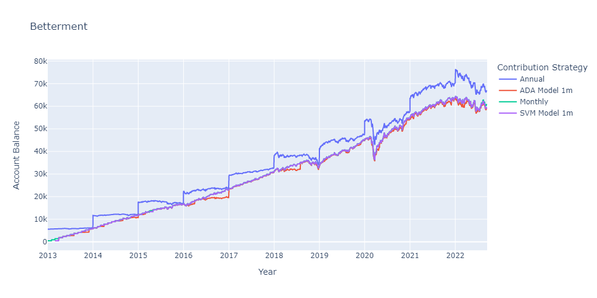
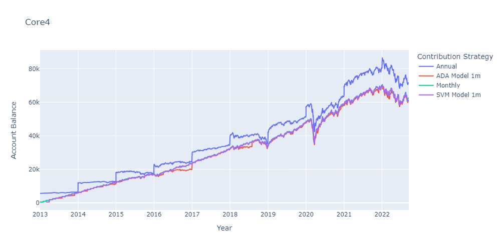
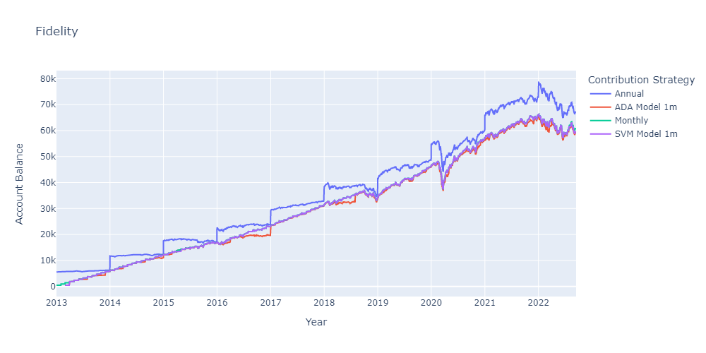
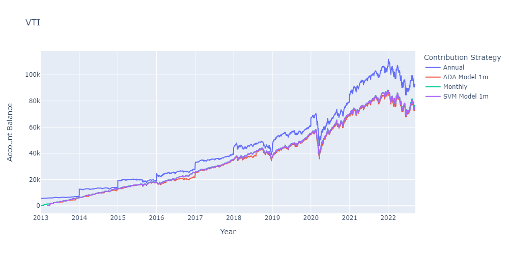

# MMP Retirement Prediction

A predictive model to maximize retirement savings through optimization of contribution strategy.

Using annual IRA contribution limits, we model 4 contribution strategies implemented on multiple portfolios. 

The contribution strategies we consider are: 

* Annual contribution made on the first business day of the year
* Monthly contribution made on the first business day of the month 
* Contributions made by a machine learning model, trained to predict the next 1, 2 or 3 months of market movement
* Contributions made by an alternate machine learning model, trained to predict the next 1, 2 or 3 months of market movement

To find a portfolio to conduct our analysis, we began by looking through portfolios listed in the [whitecoat investor](https://www.whitecoatinvestor.com/150-portfolios-better-than-yours/comment-page-3/) and selected the following 4 to consider further. 

1) Vanguard Total Stock ETF
2) Fidelity Indexed Focused Models
3) Betterment
4) Rick Ferris Core 4

We chose portfolio 1 as an indicator of the general market movements. This is the fund we used to train our models. 

### The Machine Learning Models

We selected the [SVM model](https://gist.github.com/pb111/ca4680d8960c46aeb1b824a93a079fa7) as a strong classifier of 2 class predictions.   

We selected the [AdaBoost](https://scikit-learn.org/stable/modules/generated/sklearn.ensemble.AdaBoostClassifier.html) model as a model to give more weight to stronger classifiers.

### The Model Based Contribution Strategies

The models predicts the movement of the market 1, 2 or 3 months into the future and returns an instruction to contribute for the number of consecutive positive months, i.e. if the model predicts the following month will go down, it waits to invest at a lower point.   

## Noteworthy 

The portfolios have varying fixed income to equity splits and are not directly comparible against one another. 

Fidelity and Betterment are comparible asset allocations.

## Conclusion

Overall the best investment strategy was to front load the contributions for the entire year. 

Between the monthly dollar cost averaging and the machine learning model, the model created better overall outcomes. 

We recommend front loading annual contribution where cash flow allows, and otherwise using the SPECIFY WHICH MODEL PERFORMED BEST model to decide when to invest.










### Future Dev 

The current model is set up to analyse historic data. We would make adjustments to feed in current data for live execution. 

Further refine the machine learning model optimizing. 

In the time period we are analysing there is a general upward trend of the market. We would like to add in a buffer for changes in market trends, e.g. if the model underperforms for X months, retrain. 

Adjust the output to provide a recommended contribution strategy for each portfolio. 

Adjust the code to loop through all models and portfolios for efficiency.

## Installations

This application is built on python 3.7 with the following libraries:

* [pandas_datareader](https://pypi.org/project/pandas-datareader/)

``` pip install pandas-datareader ```

* [kaleido](https://pypi.org/project/kaleido/) - for saving static chart images

``` pip install -U kaleido ```

* [pandas](https://pandas.pydata.org/) - to create visual dataframes and perform financial analysis calculations
* [plotly](https://plotly.com/) - to create interactive charts
* [hvplot]() - to create interactive charts
* [pickle](https://docs.python.org/3/library/pickle.html) - to save objects and pass between notebooks


``` pip install chart_studio```

## Usage

To use this application, clone the git hub repository. 

* From your chosen Terminal run the application.py file using the instruction ``` python application.py ```.

* Choose an investment portfolio 

* Choose a machine learning model to run 

* Specify file path for saving data

In Jupyter Notebook, open portfolio returns and set the timing and portfolio parameters. 

Running this notebook, creates charts illustrating the investment balance over time. 

## Contributors 

This application has been created by Dan McQueen, Toni Mercer & Peter Paquette, more commonly known as the MMP Retirement Team. 


